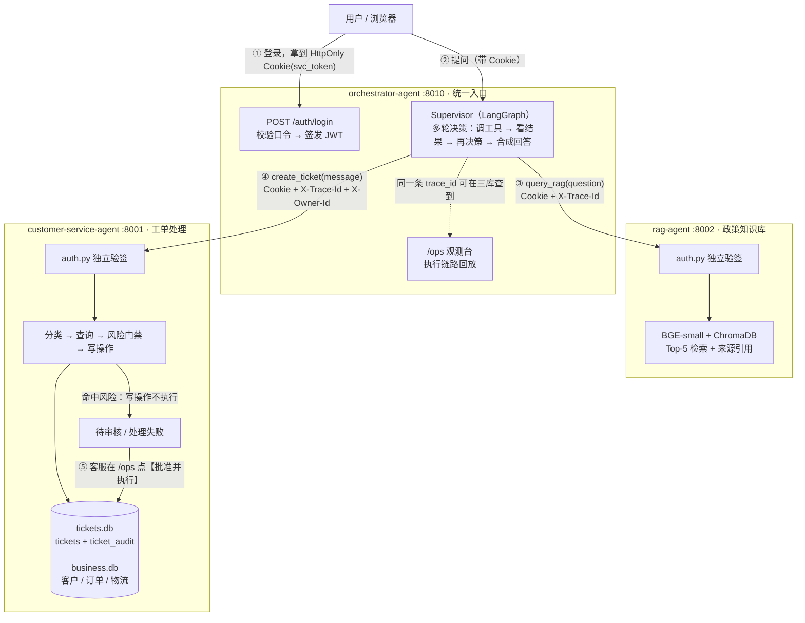

# 智能客服 Agent 平台 — 三个服务的一体化交付

[](https://github.com/Apexyunhnao/orchestrator-agent/actions/workflows/ci.yml)

三个独立部署、互相协作的 Agent 服务，构成一条完整的客服业务链路：
**统一入口编排 → 政策知识库问答 → 工单处理与人工审核**。

| 服务 | 仓库 | 端口 | 职责 |
|---|---|---|---|
| **orchestrator-agent** | 本仓库 | `8010` | 统一入口 / 编排器：认证签发、多轮工具决策、跨服务 trace 贯通、观测台 |
| **rag-agent** | [Apexyunhnao/rag-agent](https://github.com/Apexyunhnao/rag-agent) | `8002` | 政策知识库问答：向量检索 + 带来源引用的回答 |
| **customer-service-agent** | [Apexyunhnao/customer-service-agent](https://github.com/Apexyunhnao/customer-service-agent) | `8001` | 工单处理：意图分类、8 个业务工具、风险门禁、人工审核闭环 |

---

## 1 架构与调用链



**一次请求的完整链路**（真实示例）：

```
用户提问 → ① p1 签发/校验身份 → ② Supervisor 第 1 轮决策：调 query_rag
         → ③ rag-agent 独立验签 → 向量检索 → 返回答案 + 来源
         → ④ Supervisor 第 2 轮决策：调 create_ticket（携带 X-Trace-Id / X-Owner-Id）
         → ⑤ customer-service-agent 独立验签 → 分类 → 查询 → 风险门禁
         → ⑥ 命中风险：写操作「不执行」，落 proposed_action，状态=待审核
         → ⑦ 客服在 /ops 批准 → 原子更新状态 + 执行该动作 + 写审计
```

---

## 2 安全边界

平台的安全设计集中在四个位置，**每一处都独立生效，不依赖上游自觉**：

| # | 边界 | 位置 | 做法 |
|---|---|---|---|
| 1 | **身份** | `orchestrator-agent/auth.py` 签发；另两个服务各自的 `auth.py` **独立验签** | JWT 放在 `HttpOnly` + `SameSite=Strict` Cookie（`svc_token`）里，前端 JS 读不到、跨站请求带不上。三个服务共用同一个 `AUTH_SECRET`，但**谁都不相信上游传来的角色字符串**，只信自己验出来的 |
| 2 | **越权** | 各服务的 `require_roles(...)` | 未登录 → `401`；已登录但角色不够 → `403`。客户访问 `/stats`、工单列表这类运营数据一律 `403` |
| 3 | **数据边界** | `customer-service-agent/main.py` | 工单归属用编排层透传的 `X-Owner-Id`（登录用户的不可变 `owner_id`），**不用请求体里可伪造的字段**；客户侧只能走 `/api/my/tickets` |
| 4 | **副作用边界** | `customer-service-agent/nodes.py` | **风险门禁位于写工具之前**：先只跑查询 → 判风险 → 通过才执行写操作；命中风险的写操作**根本不执行**，落成结构化 `proposed_action` 等人工批准 |

> 第 4 条是本平台最关键的顺序设计：
> 最初的实现是"先执行工具、再判风险"，风险判定只是**事后标记**，写操作早已发生。

另外：`auth.py` 在账号不存在时**也会走一次 bcrypt 校验**再返回失败，避免用响应时间区分"账号是否存在"。

---

## 3 P0 / P1 / P2 能力清单

三轮改造，每轮都有可运行的验证证据。

### P0 — 跨服务关联 ID 贯通

| 能力 | 落点 |
|---|---|
| 统一 trace 生成与传递 | p1 生成或沿用 `X-Trace-Id`，经 `tools.py` 透传下游 |
| 三库同 trace 可查 | `gateway_logs` / `tickets` / `queries` 三张表都有 `trace_id` 列 |
| 完整执行链路留痕 | `gateway_logs.steps` 存整条 LangGraph 执行链，`/ops` 可回放 |

**证据**：同一个 `trace_id` 在三张表各查到 1 行（见演示脚本环节 9）。

### P1 — 认证与权限

| 能力 | 落点 |
|---|---|
| 三个演示账号 | 客户 `customer` / 客服 `agent` / 管理员 `admin`（`owner_id` 分别为 `CUST-1001` / `AGENT-01` / `ADMIN-01`） |
| JWT + HttpOnly Cookie | `orchestrator-agent/auth.py`，默认 2 小时有效 |
| 下游独立验签 | `rag-agent/auth.py`、`customer-service-agent/auth.py` |
| 权限分层 | `/stats`、`/ops`、工单列表要求 `agent`/`admin` |
| 输入校验 | 空消息 / >500 字 / 非中文 → `400` |

**证据**：`tests/test_auth.py` 26/26 通过。

### P2 — 风险门禁与人工审核闭环

| 能力 | 落点 |
|---|---|
| 风险门禁前移到写操作之前 | `nodes.py` `handle_node`：查询与写分离执行 |
| 结构化待审批动作 | `proposed_action` = 工具名 + 参数 + **数据快照** + **规则版本** + 风险依据 |
| 状态机分流 | 高风险→`待审核`；工具失败→`处理失败`；信息不足→`待审核`；正常→`处理中`→`已解决` |
| 原子审批 | `BEGIN IMMEDIATE` + `UPDATE ... WHERE status='待审核'` + 受影响行数校验 |
| 审计表（只追加） | `ticket_audit`：操作人 ID/角色、前后状态、原因、结果、`source_trace_id` + `approval_trace_id` |
| 人工审核界面 | `/ops` 上的待审批动作区块、批准/驳回按钮、审计时间线 |

**证据**：`probe18` 16/16、`probe22` 5/5（含两个线程同时批准的并发验证）。

---

## 4 最短启动与演示

### 4.1 启动三个服务

**Windows 一键**（推荐）—— 在 `orchestrator-agent` 目录下运行：

```bat
start-demo.bat
```

它先准备密钥、再按 **p1 → p2 → rag 串行**启动（并行启动会抢 CPU 导致 RAG 加载超时）：

1. **准备三仓共享的 `AUTH_SECRET`**（幂等：三仓都空才生成一次随机密钥写入各自 `.env`）
2. 启动三个服务：

```
p1 orchestrator :8010      p2 customer :8001      rag :8002
```

> **认证是 fail-closed 的**：没配 `AUTH_SECRET` 服务会**直接拒绝启动**（不再回落到固定默认密钥）。
> 三个服务必须共用同一个值 —— 只配一个、或配成不同的值，跨服务验签会全部 401。
> 不一致时运行：`python scripts/demo_bootstrap.py --force-sync`；手工配置见各仓 `.env.example`。

**手动逐个启动**（三台终端，顺序同上）：

```bash
cd orchestrator-agent        && python -m uvicorn main:app --host 127.0.0.1 --port 8010
cd customer-service-agent    && python -m uvicorn main:app --host 127.0.0.1 --port 8001
cd rag-agent                 && python -m uvicorn main:app --host 127.0.0.1 --port 8002
```

**首次运行前装依赖**（基准环境 Python 3.11）：

```bash
python -m venv .venv                      # Windows 激活：.venv\Scripts\activate
pip install -r requirements.lock.txt      # ← 装锁文件（含全部传递依赖，版本完全一致）
```

> `requirements.txt` 是**人读的直接依赖清单**；`requirements.lock.txt` 由 `uv pip compile`
> 从清单生成，锁定全部传递依赖 —— **复现环境装锁文件，不要装清单**（清单只写下界）。
>
> rag 需先 `python ingest.py` 入库（Embedding 模型首次下载约 400MB）；
customer-service-agent 需先 `python data/migrate_to_sqlite.py` 建业务库。

**健康检查**：

```bash
curl http://127.0.0.1:8010/health     # {"orchestrator":"ok","rag":"ok","ticket":"ok"}
curl http://127.0.0.1:8001/health     # {"healthy":true,...}
curl http://127.0.0.1:8002/health     # {"healthy":true,...}
```

> ⚠️ 本机 Windows 有系统代理，命令行调 localhost 建议先 `set NO_PROXY=127.0.0.1,localhost`；
> 代码侧已统一用 `trust_env=False` 规避。

### 4.2 演示账号

| 账号 | 口令 | 角色 | 可见范围 |
|---|---|---|---|
| `customer` | `customer123` | 客户（张敏，`CUST-1001`） | 只能看自己的工单 |
| `agent` | `agent123` | 客服（李强，`AGENT-01`） | 工单列表、详情、批准/驳回、`/stats` |
| `admin` | `admin123` | 管理员（王磊，`ADMIN-01`） | 同客服 |

三个服务**共用同一个 Cookie**（`svc_token`，作用域 `127.0.0.1`）。
因此**只需在 `http://127.0.0.1:8010/` 登录一次**，直接打开 `http://127.0.0.1:8001/ops` 就是已登录状态。

### 4.3 三条演示入口

| 入口 | 地址 | 展示什么 |
|---|---|---|
| 对话页 | `http://127.0.0.1:8010/` | 输入问题 → 流式回答 + 工具调用过程 + `trace_id` |
| 编排观测台 | `http://127.0.0.1:8010/ops` | 每次请求的执行链路（各节点耗时、工具调用、命中哪个规则） |
| 工单审核台 | `http://127.0.0.1:8001/ops` | 待审核工单的待审批动作、批准/驳回、审计时间线 |

### 4.4 最短演示（约 90 秒，高风险退款审核）

在 `http://127.0.0.1:8010/` 用 `agent` / `agent123` 登录，发一条消息：

```
退款要什么条件？你们发的是翻新机，我要投诉到12315，帮我把 ORD-1010 的 168 元退了
```

预期结果（真实实测输出）：

| 观察点 | 预期 |
|---|---|
| 工具调用 | `query_rag` → `create_ticket`（两轮决策） |
| RAG 来源 | 换货政策 / 退货政策 / 退款政策 |
| 工单状态 | **待审核**（不是已关闭） |
| 待审批动作 | `process_refund {order_id: ORD-1010, amount: 168}`——**尚未执行** |
| 风险依据 | 用户消息含敏感词「投诉」 |

然后切到 `http://127.0.0.1:8001/ops`，选中这条工单 → 点【批准并执行】：

| 观察点 | 预期 |
|---|---|
| 状态 | 待审核 → **已解决** |
| 处理结果 | `（人工审批后执行）订单 ORD-1010 退款 168 元已受理，预计 3-5 个工作日原路退回。` |
| 审计时间线 | `created`（system）→ `approve`（agent），两条都带 trace |
| 再点一次批准 | `409`，提示"只有「待审核」可审批"，**不会重复执行** |

---

## 5 指标口径（⚠️ 引用前必读）

数字全部来自各仓库 `eval/results.json`（由 `eval/run_eval.py` 自动生成，**禁止手写**）。

### 5.1 orchestrator-agent

| 指标 | 数值 | 口径 |
|---|---|---|
| **期望工具覆盖率** | **96.9%（31/32）** | **主要业务指标**：期望被调用的工具是否都真的被调用了（子集判定 `set(expected) ⊆ set(actual)`，多调不判错）。衡量的是**覆盖**，不是"调得准不准" |
| 边界模糊场景 | 88.9%（8/9） | 模糊 / 口语化 / 情绪化 / 缺订单号输入下仍正确路由 |
| 三轮链路验证 | ✅ | 查政策 → 建工单 → 查物流 |
| 上下文传递验证 | ✅ | RAG 答案传入客服 Agent 继续决策 |
| 降级验证 | ✅ | RAG 离线时返回"知识库暂不可用"，不阻断主流程 |
| keyword_accuracy | 53.1%（17/32） | **严格关键词命中指标，不是业务准确率** |

**唯一失败用例**：`S28`（期望工具未被调用）。

### 那 15 条关键词未命中，逐例归因（可复核）

`eval/results.json` 的 `keyword_fail_ids` 共 15 条，逐条核对实际执行结果与回答：

| 类别 | 条数 | 用例 | 说明 |
|---|---|---|---|
| **正确转人工**（设计内的安全行为） | **11** | S17 S18 S19 S20 S21 S24 S25 S27 S29 S30 S32 | 缺订单号 / 信息不足 → 按设计转人工，回答形如「【转人工】原因：无法确定需要调用的工具，信息不足」——天然不含政策原文关键词 |
| 业务办成但回答未复述关键词 | 2 | S12（换货成功）、S31（退款成功） | 工具调用正确、业务真实完成，只是回答里没再出现「质量」「7天」这类词 |
| 风险规则正确拦截 | 1 | S11 | 物流停滞 ≥3 天 → 触发风险拦截转人工，属正确行为 |
| **测试数据缺陷**（与系统无关） | 1 | S15 | 用例用了库里**不存在**的订单号 `ORD-2001` → 工具如实报「订单不存在」 |

**结论：15 条里 0 条是「回答了政策问题却答错」。**
12 条是设计上的安全行为（转人工 / 风险拦截），2 条是回答措辞未复述关键词，1 条是测试数据本身的缺陷。

> 这是 `keyword_accuracy` 只作参考、不作业务指标的直接证据：
> 用它衡量生成质量时，**「正确地转人工」会被判为未命中**。

> **口径红线**：`keyword_accuracy` 检查最终回答里是否**逐字出现**用例预设关键词。
> 但很多场景的正确行为就是转人工或建工单由业务侧补全信息，回答形如"已转人工，原因：…"，
> 天然不含政策原文关键词——**这类安全的正确行为会被该指标判为未命中**。
>
> ✅ 正确表述："期望工具覆盖率 96.9%（主要业务指标）；关键词命中率 53.1% 是严格口径，受自由措辞影响，仅作参考"
> ❌ 禁止表述："系统准确率 96.9%" / "准确率 53.1%" / 把两个数字混用或省略口径

### 5.2 customer-service-agent

| 指标 | 全量（59 条） | 留出集（12 条） |
|---|---|---|
| 分类准确率 | 98.3%（58/59） | **100%** |
| **行动准确率** | **100%（59/59）** | **100%** |
| 自动处理成功率 | 100%（25/25） | **100%** |
| 工具覆盖准确率 | 92.0%（23/25） | **100%** |
| 实际转人工率 | 57.6%（34/59，与期望完全吻合） | 50.0% |

### 5.3 rag-agent

| 指标 | 全量（20 条） | 留出集（4 条） |
|---|---|---|
| **检索命中率** | **100%（20/20）** | **100%** |
| 回答准确率 | 95.0%（19/20） | **100%** |
| 来源正确率 | 90.0%（18/20） | 50%（2/4，跨文档对比类问题只标了单一来源） |

---

## 6 已知限制

完整清单（含根因与改进优先级）见 **`docs/METRICS-指标口径与已知限制.md`**。摘要：

- **不是生产系统**：这是 0→1 的 MVP 验证，无真实用户、无压测、无运维方案
- **资金类是模拟执行**：`process_refund` / `refund_price_diff` / `urge_delivery` / `process_exchange` 只写状态，没有真实支付链路
- **审批人无金额分级**：任意 `agent` 都能批准任意金额，未做"大额需 admin"的分级
- **退款金额依赖提取**：用户没说金额时提取为 `0`（不编造），演示需显式说金额
- **进入待审核无通知**：没有推送提醒客服
- **无会话记忆**：每次请求独立，用户说"刚才那个订单"无法理解
- **单线程 uvicorn**：无并发处理、无限流
- **本次改造前的历史工单没有审计记录**（`ticket_audit` 表是新建的）

---

## 7 仓库文档索引

| 文档 | 内容 |
|---|---|
| `README.md`（本文） | 平台总览：架构、安全边界、P0/P1/P2、启动与演示、指标口径 |
| `docs/METRICS-指标口径与已知限制.md` | 三仓指标口径、已知限制、改进优先级 |
| `docs/development-log.md` | 开发日志（迭代过程与决策） |
| `docs/limitations.md` | 早期的问题与局限评估（**部分条目已在 P0/P1/P2 修复，见上方索引文档**） |
| `docs/20260916_流式输出实现记录.md` | 流式输出（SSE）的实现与排错记录 |
| `docs/probes/` | 排障探针脚本与截图归档 |

---

## 8 技术栈

| 层 | 选型 |
|---|---|
| 编排 | LangGraph（状态图 + 条件边 + 多轮工具循环） |
| LLM | DeepSeek（`deepseek-chat`） |
| 检索 | ChromaDB（余弦相似度）+ BAAI/bge-small-zh-v1.5（本地 CPU） |
| 存储 | SQLite（业务库 + 工单库 + 审计表 + 请求日志） |
| 接口 | FastAPI + uvicorn |
| 认证 | PyJWT（HS256）+ bcrypt + HttpOnly Cookie |
| 前端 | FastAPI 内嵌 HTML/JS（无构建步骤） |
